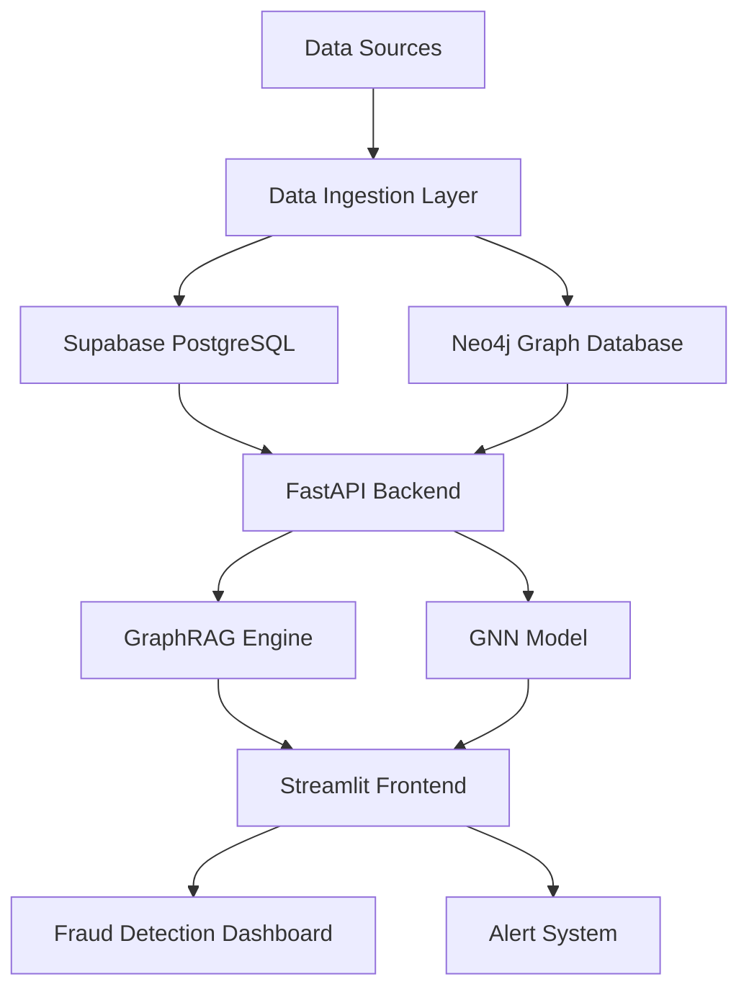

# Fraud Detection System with GraphRAG and GNN

This project implements an end-to-end fraud detection system using GraphRAG (Graph-based Retrieval Augmented Generation) and Graph Neural Networks (GNN). The system integrates Supabase PostgreSQL for structured data storage, Neo4j for graph database operations, and provides a user interface through Streamlit with FastAPI backend.

## Architecture



## System Components

1. **Data Sources**
   - Transaction data
   - User profiles
   - Historical fraud cases
   - Network activity logs

2. **Data Storage**
   - Supabase PostgreSQL: Stores structured data (transactions, user profiles)
   - Neo4j: Stores graph relationships (user connections, transaction patterns)

3. **Backend (FastAPI)**
   - RESTful API endpoints
   - GraphRAG implementation
   - GNN model integration
   - Data processing pipeline

4. **Frontend (Streamlit)**
   - Interactive dashboard
   - Real-time fraud alerts
   - Network visualization
   - Risk scoring display

## Project Structure

```
fraud_detection/
├── backend/
│   ├── api/
│   │   ├── __init__.py
│   │   ├── routes.py
│   │   └── models.py
│   ├── core/
│   │   ├── __init__.py
│   │   ├── config.py
│   │   └── database.py
│   ├── models/
│   │   ├── __init__.py
│   │   ├── gnn.py
│   │   └── graphrag.py
│   └── utils/
│       ├── __init__.py
│       └── helpers.py
├── frontend/
│   ├── pages/
│   │   ├── dashboard.py
│   │   └── alerts.py
│   └── components/
│       └── network_viz.py
├── data/
│   └── sample_data/
├── tests/
├── requirements.txt
└── README.md
```

## Setup Instructions

1. Clone the repository
2. Install dependencies:
   ```bash
   pip install -r requirements.txt
   ```

3. Set up environment variables:
   ```bash
   cp .env.example .env
   # Edit .env with your credentials
   ```

4. Initialize databases:
   ```bash
   python backend/core/database.py
   ```

5. Run the backend:
   ```bash
   uvicorn backend.api.main:app --reload
   ```

6. Run the frontend:
   ```bash
   streamlit run frontend/main.py
   ```

## Features

- Real-time fraud detection using GNN
- Graph-based pattern recognition
- Interactive network visualization
- Risk scoring system
- Alert management
- Historical analysis
- User profile management

## Technologies Used

- Python 3.8+
- FastAPI
- Streamlit
- PyTorch Geometric
- Neo4j
- Supabase
- NetworkX
- Pandas
- NumPy

## License

This project is licensed under the MIT License - see the [LICENSE](LICENSE) file for details.

### License Details

The MIT License is a permissive license that is short and to the point. It lets people do anything they want with the code as long as they provide attribution back to you and don't hold you liable.

#### What you can do with this code:
- ✅ Use it commercially
- ✅ Modify it
- ✅ Distribute it
- ✅ Use it privately
- ✅ Sublicense it

#### What you must do:
- ✅ Include the original copyright notice
- ✅ Include the license text

#### What you cannot do:
- ❌ Hold the authors liable
- ❌ Use the authors' names/trademarks without permission

### Third-Party Licenses

This project uses several third-party libraries and tools. Their respective licenses are:

- FastAPI: [MIT License](https://github.com/tiangolo/fastapi/blob/master/LICENSE)
- Streamlit: [Apache 2.0 License](https://github.com/streamlit/streamlit/blob/develop/LICENSE)
- PyTorch Geometric: [MIT License](https://github.com/pyg-team/pytorch_geometric/blob/master/LICENSE)
- Neo4j Python Driver: [Apache 2.0 License](https://github.com/neo4j/neo4j-python-driver/blob/5.0/LICENSE)
- Supabase: [MIT License](https://github.com/supabase/supabase-js/blob/master/LICENSE)
- NetworkX: [BSD 3-Clause License](https://github.com/networkx/networkx/blob/main/LICENSE.txt)
- Pandas: [BSD 3-Clause License](https://github.com/pandas-dev/pandas/blob/main/LICENSE)
- NumPy: [BSD 3-Clause License](https://github.com/numpy/numpy/blob/main/LICENSE.txt)
- Confluent Kafka: [Apache 2.0 License](https://github.com/confluentinc/confluent-kafka-python/blob/master/LICENSE)

### Contributing

When contributing to this project, please ensure that your contributions are also licensed under the MIT License. By contributing, you agree that your contributions will be licensed under the same terms as the project.

## Running the Kafka Components

The system includes Kafka integration for real-time transaction streaming and alert processing. To run the Kafka components:

1. Make sure you have a Confluent Kafka cluster running and accessible.

2. Update your `.env` file with the Kafka configuration:
   ```
   KAFKA_BOOTSTRAP_SERVERS=your-kafka-bootstrap-servers
   KAFKA_API_KEY=your-kafka-api-key
   KAFKA_API_SECRET=your-kafka-api-secret
   KAFKA_SCHEMA_REGISTRY_URL=your-schema-registry-url
   KAFKA_SCHEMA_REGISTRY_API_KEY=your-schema-registry-api-key
   KAFKA_SCHEMA_REGISTRY_API_SECRET=your-schema-registry-api-secret
   KAFKA_TRANSACTIONS_TOPIC=transactions
   KAFKA_ALERTS_TOPIC=alerts
   ```

3. Start the transaction generator (in a new terminal):
   ```bash
   python data/sample_data/kafka_generator.py
   ```
   This will start generating and streaming test transactions to Kafka.

4. Start the transaction processor (in another terminal):
   ```bash
   python data/sample_data/kafka_consumer.py
   ```
   This will process the transactions and generate alerts for suspicious activities.

The transaction generator will continuously stream test data to Kafka, and the processor will analyze these transactions in real-time, generating alerts for transactions that exceed the risk threshold.

## Testing

The project includes comprehensive tests for all major components. To run the tests:

1. Install test dependencies:
   ```bash
   pip install pytest pytest-cov
   ```

2. Run the tests:
   ```bash
   pytest tests/ --cov=backend --cov-report=html
   ```

This will run all tests and generate a coverage report in the `htmlcov` directory.

### Test Structure
- `tests/test_models.py`: Tests for GNN and GraphRAG models
- `tests/test_api.py`: Tests for FastAPI endpoints
- `tests/test_kafka.py`: Tests for Kafka client functionality

## Docker Deployment

The project includes Docker configuration for easy deployment and development. The setup includes:

- FastAPI backend service
- Streamlit frontend service
- Neo4j database
- Kafka cluster with Schema Registry
- Zookeeper for Kafka coordination

### Prerequisites
- Docker
- Docker Compose
- Environment variables configured in `.env`

### Running with Docker

1. Build and start all services:
   ```bash
   docker-compose up --build
   ```

2. Stop all services:
   ```bash
   docker-compose down
   ```

3. View logs:
   ```bash
   docker-compose logs -f
   ```

### Accessing Services
- FastAPI Backend: http://localhost:8000
- Streamlit Frontend: http://localhost:8501
- Neo4j Browser: http://localhost:7474
- Kafka Schema Registry: http://localhost:8081

### Development with Docker

For development, you can use the following commands:

1. Rebuild a specific service:
   ```bash
   docker-compose up --build app
   ```

2. Run tests in the container:
   ```bash
   docker-compose exec app pytest tests/
   ```

3. Access container shell:
   ```bash
   docker-compose exec app bash
   ```

### Volume Management
The Docker setup includes persistent volumes for:
- Neo4j data
- Neo4j logs
- Neo4j plugins
- Application models
- Application data

To clean up volumes:
```bash
docker-compose down -v
``` 